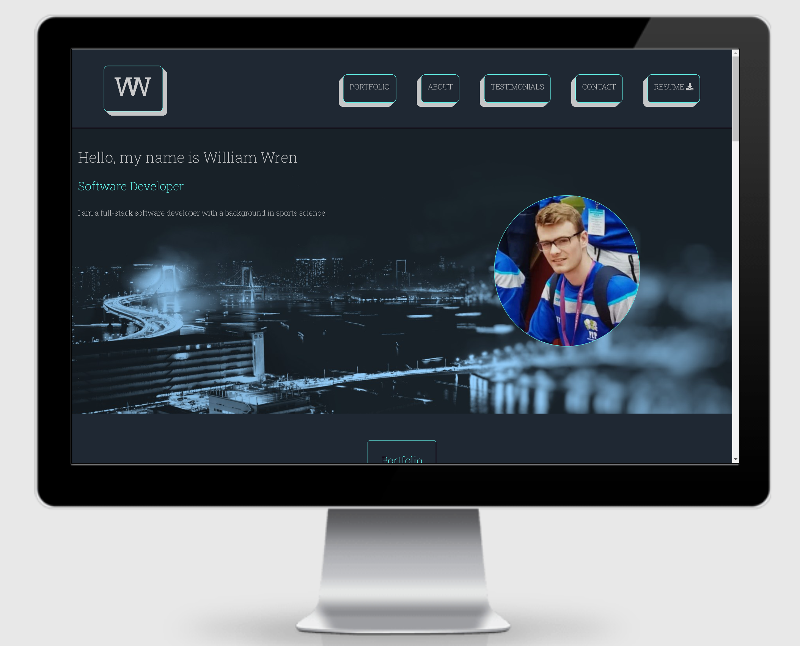
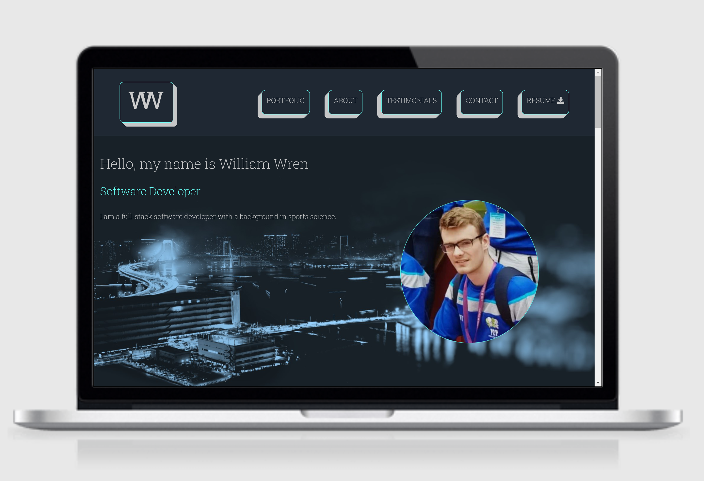
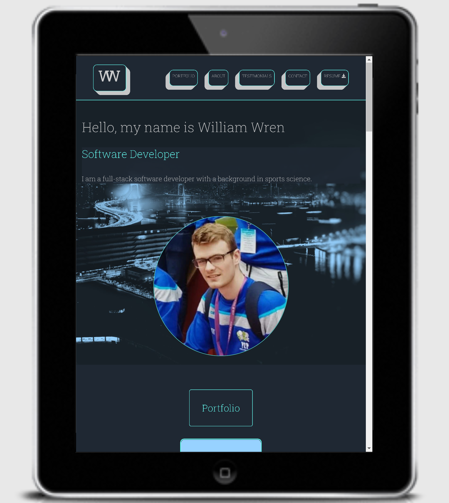
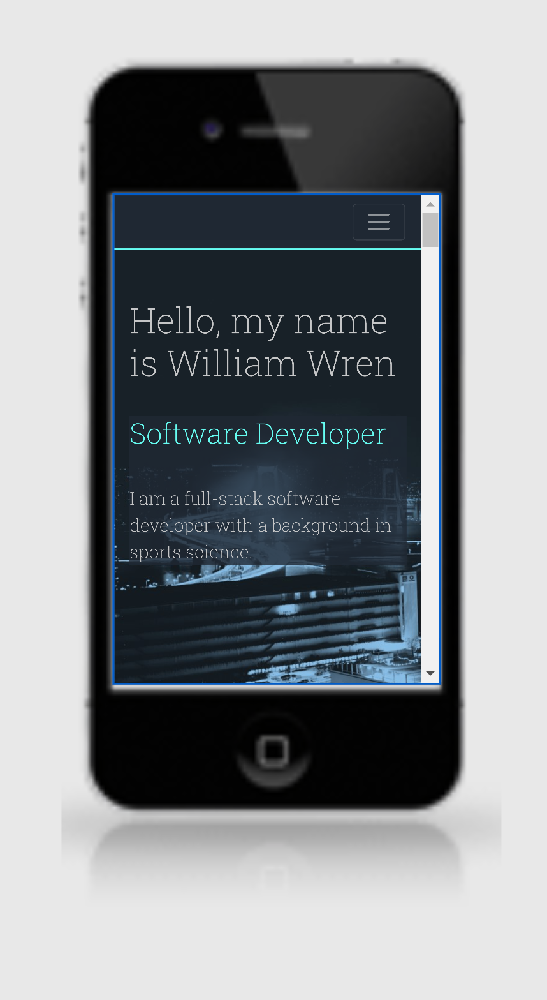

# William's Personal Portfolio
A well designed, visually pleasing and informative website to demonstrate to employers my suitability for a 
developer role and provide a means for other developers to collaborate. 

## Project purpose
The purpose of this website was to showcase my skills and portfolio to potential employers and collaborators.
The site itself is a demonstration of my ability to write HTML and CSS. 

The website has the following sections:
* Home page

  The home page contains a navigation bar linking to all of the other sections and a brief introduction to the website designer.

* Portfolio

  The portfolio section displays four projects that link to Github repositories.

* About

  The about section lists the technologies that the portfolio owner has experience with, educational background and specific areas of expertise.

* Testimonials

  The testimonials section lists two references from past lecturers of the portfolio owner.

* Interests and hobbies

  The interests and hobbies section lists the portfolio owners interests and hobbies.

* Contact

  The contact section contains a form in which a visitor may send the website owner an email.

## UX

### User stories

* As an employer, I want to see a well designed and visually appealing website that demonstrates the technical ability of the applicant.

    * This need was fulfilled through the website itself demonstrating the applicant's technical ability.

* As an employer, I want to see the applicants strengths to assess which role the applicant is best suited to.

    * The expertise section lists what the applicant believes to be his strengths.

* As a software engineer, I want to gain an understanding of the interests, strengths and goals of the portfolio owner to assess whether a collaboration may be possible.

    * The website designer covered their interests, strengths and future project plans.

* As the website owner, I want a simple to use website that allows me to easily showcase my lastest projects to others.

    * Adding additional projects to the website will be an easy process due to the simplistic column layout of the project images.

* As the website owner, I don't want users to be able to submit an empty form.

    * This need was met by giving the 'required' attribute to the form input elements.

### Strategy
__Goal__: Create a website to showcase my software development skills to potential employers and facilitate collaboration with other developers. 

### Scope
* Static website containing a personal bio, projects, interests, work history, strengths and a downloadable resume.

#### Colour Scheme
* #c5c6c7 - font color
* #66fcf1 - highlight font color
* #1f2833 - background color

#### Typography
* Roboto slab is the font used throughout the webpage with the font serif as the fallback font in the case of the default font failing to load correctly.
* Line spacing of 1.5 is used throughout the website.
* A font-weight of 300, 200, 200 and 100 is used on the h1s, h2s, h3s and body element, respectively.

#### Imagery
* Images were tinted blue in Microsoft PowerPoint to match the body background color.

### Wireframes
* [Mobile View](https://github.com/Wbwren/personal-portfolio/blob/master/wireframes/mobile-wireframe.png)

* [Tablet View](https://github.com/Wbwren/personal-portfolio/blob/master/wireframes/tablet-wireframe.png)

* [Desktop View](https://github.com/Wbwren/personal-portfolio/blob/master/wireframes/desktop-wireframe.png)

## Technologies Used
### Languages used
* HTML5
* CSS3

### Frameworks, Libraries & Programs Used
* [Bootstrap](https://getbootstrap.com/docs/4.5/getting-started/introduction/)
* [Google Fonts](https://fonts.google.com/)
* [Font Awesome](https://fontawesome.com/)
* [Git](https://git-scm.com/)
* [Github](https://github.com/)
* [Gitpod](https://www.gitpod.io/)
* [Balsamiq Wireframes](https://balsamiq.com/wireframes/)
* [Microsoft PowerPoint](https://office.live.com/start/powerpoint.aspx)
* [Microsoft Word](https://office.live.com/start/word.aspx)
* [Google Chrome Developer Tools](https://developers.google.com/web/tools/chrome-devtools)
* [AutoPrefixer](https://autoprefixer.github.io/)

## Testing
* Throughout the development process, Chrome developer tools were used to assess each change.

* Using Chrome developer tools a wide variety of device sizes and resolutions were tested.

* The website has been tested on an iPhone 5, Samsung Galaxy s10, Acer swift 3 and a desktop PC with a 1080p and 4k monitor. All sections were assessed on each device to ensure each section was fully functioning.

* W3C Markup and CSS validation services were used to test code validity. Errors were identified and subsequently rectified.

* The website [Am I Responsive](http://ami.responsivedesign.is/) was also used as seen below.

 

### Functionality test
| Num | Test          | Action | Test result |
| ---|:-------------:| :----: | :-----:|
| 1 | Navigation items take the user to relevant section | Click each navigation item on the desktop, tablet and mobile screen sizes  | Passed |
| 2 | Mobile navigation drop-down button displays navigation list when selected | Click navigation bar dropdown icon | Passed
| 3 | Project section images direct user to GitHub when selected | Click each project image at various screen resolutions | Passed
| 4 | Both Download resume links open a new browser window and display cv.pdf | Click on both resume download links | Passed

| Num | Browser         | Test result |
| ---|:-------------:| :----: |
| 1 | Chrome | Passed
| 2 | Opera | Passed
| 3 | Mozzilla | Passed

## Deployment to Github Pages
1. Create a Github account at [github.com](https://github.com/)

2. Click on the 'New' button in the top left corner

3. Enter a name for the repository, check the 'Add a README file' box

4. Click 'Create repository'

5. Open the repository in Gitpod

6. Save changes by clicking the save button

7. Once a feature has been successfully created using the 'git add .' command to stage the changes made

8. Then use the command 'git commit -m"[enter commit title here]"'

9. All meaningful changes to the code should have its own commit

10. To push the commits to Github use the command 'git push'

11. Once the website is ready for deployment return to [github.com](https://github.com/)

12. Click on the 'settings' tab

13. Scroll down to the 'GitHub Pages' section

14. Click the 'None' dropdown button

15. Select the master branch

16. Click save

17. After a few minutes, the site will be published to GitHub pages and can be accessed using the URL at the GitHub Pages section

## Clone
1. Follow this link to my [Github Repository](https://github.com/Wbwren/personal-portfolio) and open it.

2. Click 'Clone or Download'.

3. In the Clone with HTTPs section, click the 'copy' icon.

4. In your local Integrated Development Environment open Git Bash.

5. Change the current working directory to where you want the cloned directory to be located.

6. Type 'git clone', and paste the URL you copied before.

7. Press enter and your local clone will be available.

## Credits
### Ackknowledgments
* [Stackoverflow](https://stackoverflow.com/) as a resource for learning and troubleshooting.
* Thank you to Alex Knight, Daria Nepriakhina, Possessed Photography and Jesper Aggergaard on [Unsplash](https://unsplash.com/) for the images.
* [Kevin Powell's YouTube channel](https://www.youtube.com/user/KepowOb) for CSS tips and tricks.
* A special thank you to my mentor Brian Macharia for being so generous with his time and providing excellent guidance throughout the process.
